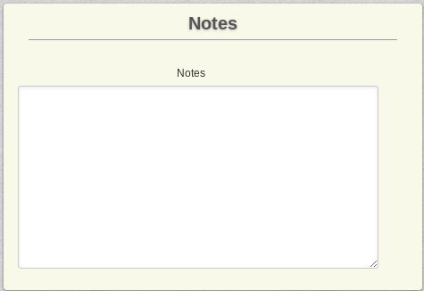

# Payment Plans

A payment plan in AEC is basically a blueprint for a membership - something that your users can buy to get a subscription. What makes a membership is really what you make the payment plan assign to it.

## General

Every Payment Plan needs a `Name`, which you provide here. Furthermore, you can `activate` or `deactivate` a plan or make it `invisible` (you can link to it, but it will not show in the frontend on its own).

The two links, `Direct Frontend Link` and `Direct Add To Cart Link`, are direct links simulating choosing the item on the frontend (useful for building your own plans page).

### Details

Once the plan is paid for, the user gets an active subscription - if you don't want that, you can deactivate this behavior by disabling `Make Active` and have them pending until your approval.

By default, payment plans take the role of a `Primary` subscription once applied, but you can also make them `Secondary`. If it is a `Secondary` subscription, you can make it at least search for another existing, similar subscription that gets updated with this subscription with `Update Existing`. This prevents the system from creating a new `Secondary` membership for every single time this plan has been purchased.

You can learn more about `Primary` and `Secondary` Memberships [here](memberships/01-memberships).

The URL put into `Always Redirect` is a hard redirect - when the user chooses this plan, it instead redirects to something else.

### Groups

Assign this plan to an existing group or delete such an assignment.

### Cost & Details

Either choose the membership to be free, or set a price - and, of course, provide a membership term.

You may also choose to hide the duration (for example if it doesn't matter).
Joomla User

You can make the payment plan assign a usergroup in Joomla.

For new members, you may also choose to force their account to be activated (instead of having to click an activation link) and skip the standard registration email (only works with Joomla registrations, not with other components).

### Joomla User

### Plan Relation

The `Plan Fallback` is a way of automatically following a subscription with another - the fallback is automatically applied (for free) once this plan runs out for a user.

If it is a secondary plan, you might run into a situation where users buy it without having a primary membership - in that case, you can force a parent plan here.

### Shopping Cart

The `Cart Behavior` can be either:

 - `Inherit` - Which let's the system decide what to do
 - `Force Cart` - To always put the item into a shopping cart
 - `Force Direct Checkout` - To always check the item out directly, circumventing any cart behavior

It's a bit tricky, but it allows for a useful feature: Instead of following the global rule of either checking out one item at a time or a full shopping cart, you can decide which one to use for this plan only. You can use this to troubleshoot confusing (to your users) system behavior if you have plans that are intended for carts or for direct checkout.

You can also `Limit Quanitity in Cart` and `Redirect on Add to Cart`, which is a custom redirect URL that the user gets sent to when the item is added to a cart.

### Notes

Internal notes on this plan.

## Trial

This is pretty much a verbatim copy of the Cost&Details above, except that it is for a Trial.

A trial for a subscription plan is always offered only once per user.

Please make sure that the processor you want to use supports trials!

## Micro Integrations

We deal with most of the other tabs in separate articles (see below), but the last tab has an important bit, the assignment of MicroIntegrations:

As you can see, this has two fields - first, the MIs it has been assigned by the Group they are in. Second, you can choose which ones you want to attach directly.

## TODO: Relationships
