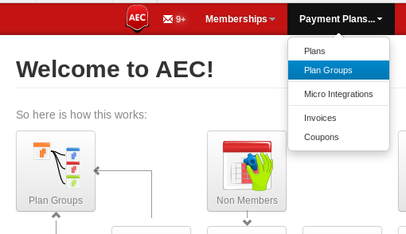
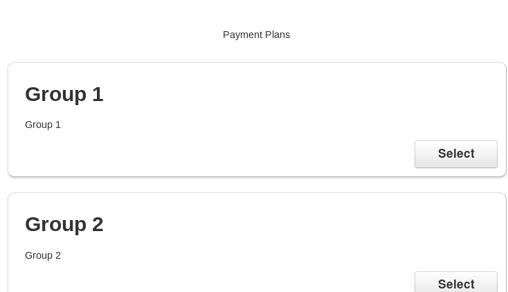
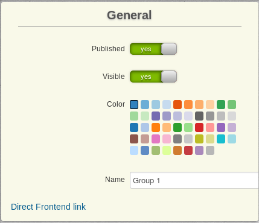

# Plan Groups

## Concept

`Plan Groups` are collections of `Payment Plans`.

Say, for example, your site has **50** `Payment Plans` - that would be a lot of plans to display on the signup screen! The most basic feature that groups give you is that you can split up your plans into a few of them so that instead of the long list of 50 options, they just see the groups. When they click on the group button, they will then see a page with just the plans in that group.

## Example

Here is an example payment plans page that has only groups:

------------

------------

Clicking a `Plan Group` then links the user to its contents:

------------

------------

## Attached Functionality

Another advantage of groups is that just like `Payment Plans`, they can have `Restrictions` and/or `Micro Integrations` attached to them, so by assigning them to the group, all plans in that group will inherit them.

## Root Group

There is a `Root Group` in AEC which cannot be deleted. All new payment plans and groups are automatically assigned to be a child item of the `Root Group`.

Please be careful when editing it and keep in mind that any change you make to it will affect all plans (unless you have removed them from the root group, which is possible).

## Settings

### General

You can `publish` or `unpublish` a `Plan Group` (making it accessible or denying access in general) and set its visibility. An `invisible` `Plan Group` can still be linked to but will not show up on its own.

### Details

With `Reveal Child Items`, the group will not shown as a group that the user can navigate into - instead, all child plans and groups will be displayed, making the group transparent.

`Group Symlink` will link the user to a page of your choosing on clicking the group link

### Parent Groups

You can assign as many parent groups as you want to a group - do keep in mind that it will inherit all `Restrictions` and `Micro Integrations`.

### Description

This is the description that shows up in the frontend box of the `Plan Group`.
