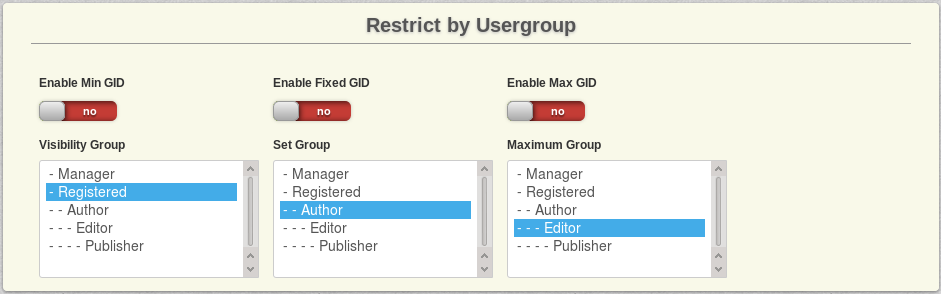

# Restrictions

Be careful setting restrictions, as you can over-restrict plans and groups easily. Usually only one restriction is needed.  It is best to test the restrictions after setting them by viewing a plans page in the front end as a user who will meet the criteria to see or not see the plan.

## By Usergroup

### Min GID

Enable this setting if you want to restrict whether a user is shown this plan by a minimum usergroup.

New users will always see the plans with the lowest GID available. GID is the Group ID.  In the images shown this site has JACL installed to create additional groups such as test and test sub.

### Fixed GID

Enable this setting if you want to restrict this plan to one particular usergroup. Only users within this usergroup can view this plan.

### Max GID

Enable this setting if you want to restrict whether a user is shown this plan by a maximum usergroup.

## By Membership

### Required Previous Plan

Enable checking for previous payment plan. A user will only see this plan if he or she used the selected plan before the one currently in use.

### Excluded Previous Plan

Do NOT show this plan to users who had the selected plan as their previous payment plan. A user will not see this plan if he or she used the selected plan before the one currently in use.

### Required Current Plan

Enable checking for currently present payment plan. A user will only see this plan if he or she is currently assigned to, or has just expired from the plan selected here.

### Excluded Current Plan

Do NOT show this plan to users who have the selected plan as their currently present payment plan. A  user will not see this plan if he or she is currently assigned to, or has just expired from the plan selected here.

### Required Used Plan

Enable checking for overall used payment plan. A user will only see this plan if he or she has used the selected plan once, no matter when.

### Excluded Used Plan

Do NOT show this plan to users who have used the selected plan. A user will not see this plan if he or she has used the selected plan once, no matter when.

### Min Used Plan

TODO

## By Membership Count

Enable checking for the minimum number of times your customers have subscribed to a specified payment plan in order to see THIS plan.

Used Amount: The minimum amount a user has to have used the selected plan.

Plan: The payment plan that the user has to have used the specified number of times at least.

Max Used Plan: Enable checking for the maximum number of times your consumers have subscribed to a specified payment plan in order to see THIS plan.

Used Amount: The maximum amount a user can have used the selected plan.

Plan: the payment plan that the user has to have used the specified number of times at most.

## By Plan Group (...Count)

These settings are exactly the same as the plan settings above - just for groups.
