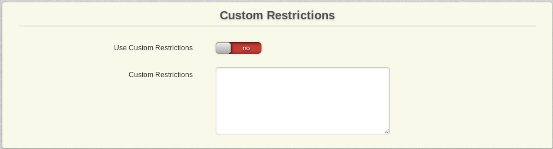

# Custom Restrictions

Use RewriteEngine fields to check for specific strings in this form: [[user_id]] >= 1500. [[parametername]] = value (Create separate rules by entering a new line) You can use =, <=, >=, <, >, <> as comparing elements. You MUST use spaces between parameters, values and comparators!

TODO: Examples!
