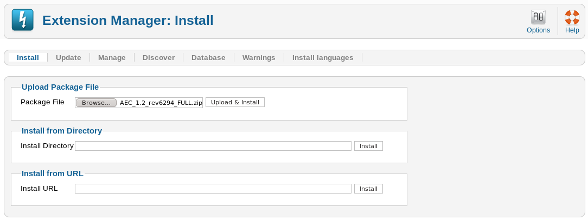
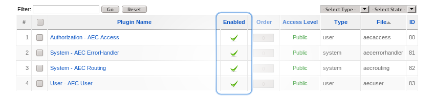
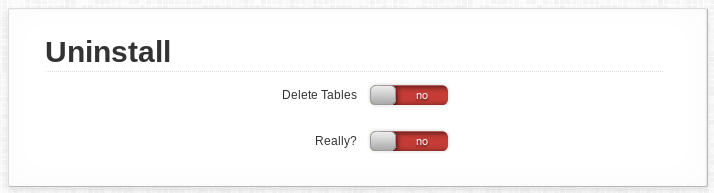

# Setup

## Requirements

### Server Requirements

  * Linux Server recommended
  * PHP 5.2+ (PHP 5.3 or later strongly recommended)
  * MySQL 4.1+

### Supported Joomla Versions

AEC works fine on any version of the Joomla! CMS - starting with 1.5, up to the very latest 3.x.

## Installing

Download the All-in-One package and upload it to your server using the standard Joomla installer.



That's really all there is to it.

### File Upload Size

Do note that the package is rather large, so if you encounter problems, make sure that your upload limit in PHP is large enough. You can set it in your `php.ini` file like so:

```
; Maximum allowed size for uploaded files.
upload_max_filesize = 5M

; Must be greater than or equal to upload_max_filesize
post_max_size = 5M
```

You may also have no access to the php.ini file. If that is the case, you may have a corresponding setting in your server configuration console - if not, you need to contact customer support for this.

### Activate AEC Plugins

To ensure that AEC runs properly, it automatically installs and activates a number of plugins. Always make sure that they are active:



### Re-trigger Install Process

AEC has quite an elaborate setup routine that does a number of system checks. If you ever find yourself wanting to do the whole thing again, but you don't want to upload the entire component, just call this URL:

http://www.yourserver.com/administrator/index.php?option=com_acctexp&task=recallinstall

This can be helpful, for instance, when you're writing your own processor as one of the things that the setup routines checks are updating whether the processor information has changed.

## Upgrading

To upgrade from an older version of AEC, **simply install the new version over the old one**. Everything will be preserved and/or upgraded.

## Uninstalling

To make sure that you don't erase your whole customer database by accident, AEC has a little security feature - if you want to actually get rid of all your data, you have to set these two settings to Yes first.



Otherwise, AEC will just leave the tables intact for when you install it the next time.
