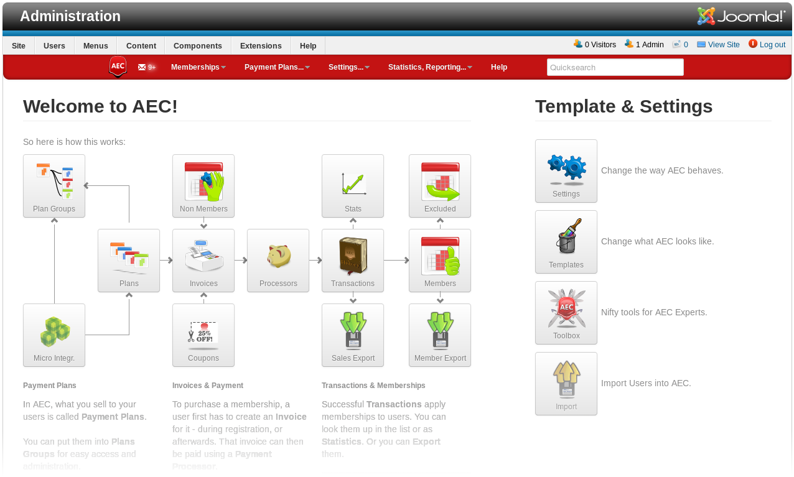
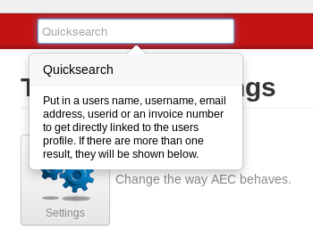
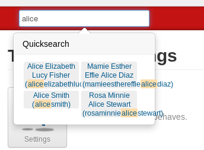

# Basic **Concepts**

## Core Terms

### Payment Plans

Anything you sell through AEC has to be captured within a `Payment Plan`. It's the blueprint for a users `Membership` and can have additional functionality attached depending on the kind of functionality you're trying to achieve.

Read more about [Payment Plans](memberships/02-payment-plans).

### Memberships

Once a user has purchased a `Payment Plan`, a new `Membership` is created and attached to the user account, or an existing `Membership` is updated.

`Memberships` typically have an expiration date and the primary `Membership` of a user account can be used to handle overall site access.

The lifecycle of the `Membership` (from payment to expiration) has events attached to it that can trigger additional functionality (like expiration notifications on expiration).

Read more about [Memberships](memberships/01-memberships).

### Micro Integrations

`Payment Plans` themselves do not have very much functionality, but you can extend their basic features by attaching `Micro Integrations` to them. You can think of them as plugins for `Payment Plans` - the difference to Joomla System plugins being that you can create unlimited instances that each have different settings.

Read more about [Micro Integrations](memberships/01-memberships).

## Quicksearch

If you need to navigate to user accounts quickly, you're going to love the Quicksearch. It's a very smart search helps finding user accounts quickly. What makes it great is how much stuff you can throw at it.

### What you can throw at it

This is the list of things the Quicksearch looks for, in this order:

  * Username or Name field
  * Email Address
  * Userid
  * Invoice Number

That way, no matter what you have on a user, just throw it in there and Quicksearch will get you to the profile.
