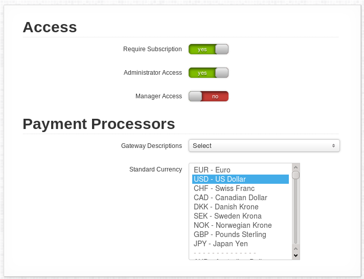
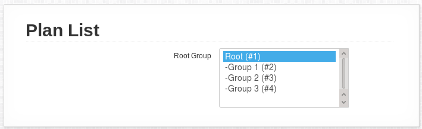
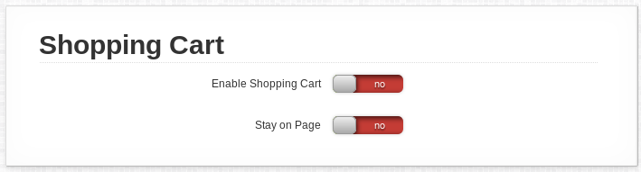
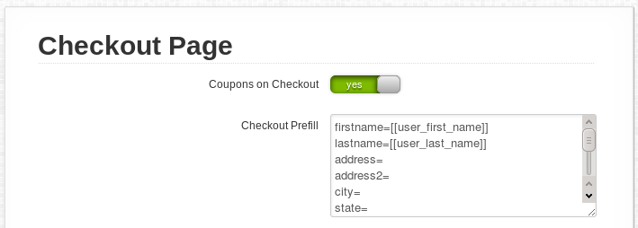
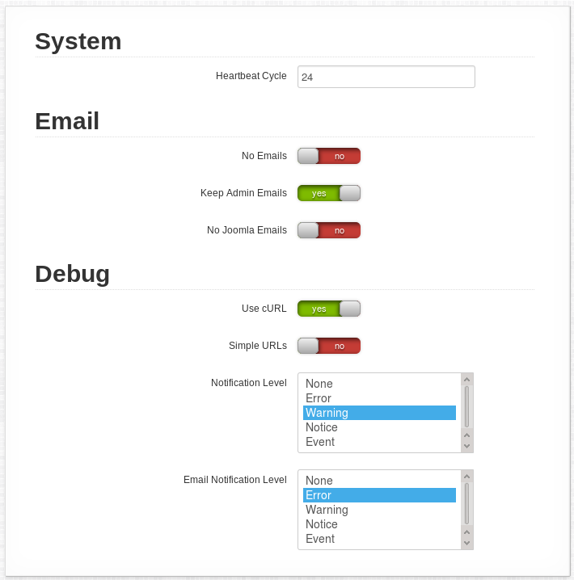

# Settings

## General Configuration

## Access

If you want AEC to always **require a membership** when a user logs in, choose to "require subscription". You can also choose whether regular **Administrators and Managers can access the AEC backend**.

## Payment Processors

You can choose whether AEC should display **descriptions for the Payment Processors** and what the **standard currency** of your system should be.

## Registration Flow

AEC keeps out of the Registration process unless you tell it to get involved. So the first thing you want to do is to tell AEC to "integrate registration". You can also choose whether it **shows the payment plan selection first**.

You can also **skip the confirmation page** if you want to slim down the signup process.

### Plan List

Select the **root plan group** that is displayed when a user hits the `subscribe` page.

### Shopping Cart

If you enable the **shopping cart**, users that already have registered can buy multiple items at the same time. The switch for **staying on the same page** prevents the user from being routed to the cart page after selecting an item. This is a good idea if you're using the AEC Cart module.

### Checkout Page

You can allow the use of **coupons on the checkout page** in addition (or instead of) the confirmation page.

Some payment processors allow for user details being sent over on the checkout action to ease filling out forms. You probably won't need this.

## Inner Workings

### System

The heartbeat is a housekeeping function that does things like expiration functionality. A heartbeat is triggered by a login - but only every X hours you put in here.

### Email

Choose to stop AEC from sending out all its standard emails. There are also a number of Joomla emails (registration notifications) we can suppress here.

### Debug

If you have trouble with SEF Urls, you can switch to simple mode here.

The notification levels determine when a notification is brought to your attention on the AEC central page, or via email directly to all administrators.
