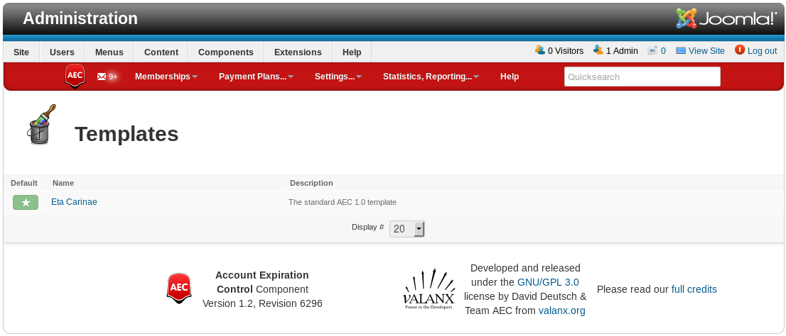
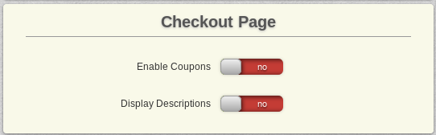

# **Eta Carinae** Template

The current frontend template in AEC is named after the [Carina Nebula](https://en.wikipedia.org/wiki/Carina_Nebula).

## Template Selection

Unless you are upgrading from an older version of AEC (where the template was named 'Helix'), you should only have one template to choose from.

## Template Settings

TODO: Overview picture of eta template settings

### Default

Switching a template do `default` makes it the system template that will be used on the frontend.

### Javascript

If your template or a system plugin or component already load jQuery and/or the bootstrap javascript libraries, you can disable AEC from loading either or both to get rid of existing or prevent future conflicts.

### Registration Flow

The CC Display is simply a function that shows accepted CreditCards for a given payment processor.

### Subscribed Member Buttons

These buttons are shown to the user on their MySubscription Page to guide them through the billing process for a new or renewed membership.

### Cart

Set a custom link where users are redirected to after putting an item into their AEC cart.

### Invoice Printout

You can allow the user to edit the top details (User Details and Address) right on the Invoice Printout.

### Confirmation Page

The first two settings allow the user to change their previous selections, both for the user details and the payment plan they selected.

With `Display Descriptions`, you can show the plan details of the plan that the user is purchasing.

Putting in a `Terms of Service` URL will add a link to it and a checkbox that the user has to confirm in order to go ahead with the checkout process. You can also choose to display the URL as a `ToS IFrame` - embedded in the page right above the checkout box.

### Checkout Page

Enable coupons and show the plan details of the payment plan that the user is purchasing.

### MySubscription Page

To navigate the features of the MySubscription page, a menu is displayed on top. If you don't need the additional pages, you can disable the menu entirely.
