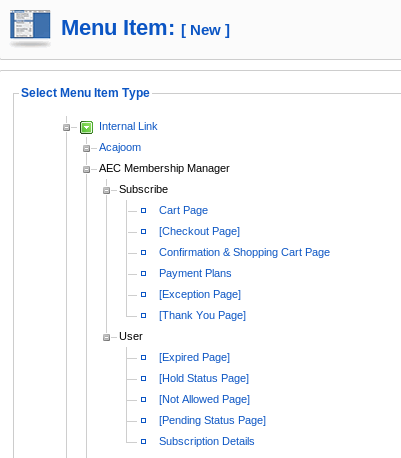

# In **Joomla**

## Add AEC Menu Items

New Menu Integration: You can now add menu items using the Joomla Menu Manager for AEC functions. The menu items below in the [Brackets] should not be visible to your users, they are supposed to be internal links that help you assign modules and other itemid related things to your AEC pages.

In your Joomla Administration go to Menus--->Pick the menu you want to add an AEC item to. Click New, and then click on AEC Membership Manager, it will expand as shown below:

To make the links for those in brackets, we suggest creating a hidden menu. First, create a new menu from the Menu Manager in your Joomla! Administrator area and call it something like ‘hiddenmenu’.

Then you can add the AEC menu items in brackets this ‘hiddenmenu’ and be sure they are Published. You will likely want them to be publicly accessible too.

You can override the ItemIDs in AEC Settings--->Page customization tab, see this FAQ.
