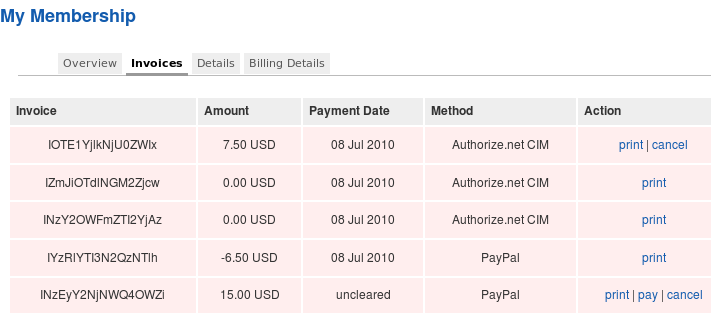

# Signup Flow

## Payment Plans first or second

AEC does not handle registration, it redirects to and wraps around the registration process of either the Joomla core registration or a registration component such as JomSocial, or Community Builder.

You have the option to skip the confirmation page if you so wish. The advantage of having the confirmation page is it gives the user the ability to change plans before going to checkout.

Joomla, by default, sends out an account activation email to the user to confirm the registration.  You can override this globally by turning off this feature. In the Joomla administration go to Site---> Global Configuration--->System tab

Change the setting from Yes to No for New User Account Activation.

You can also do this on a per plan setting in AEC.  Go to AEC Central--->Plans, and choose the plan you want to change the setting for.

Set Override Activation to Yes as shown above.  You can also turn off the Joomla default welcome email as shown above with the setting Override Registration Email to Yes.

If the user fails to checkout fully with a successful payment, when he returns to the site and logs in, he will be prompted by AEC to either go to the checkout page again, or to cancel the invoice. If he chooses to cancel he will be prompted to pick a plan again, but will NOT have to register again.

## Payment Plans on first Login

TODO: Finish this section

## Cancelling a recurring payment

Every processor is different.  For example most XML Processors such as Paypal WPP or Authorize..net CIM or ARB, there is a link in the my subscriptions area for the user to cancel.  See this FAQ on how to create AEC menu items.

Once this menu item is created, and the user clicks on it, he will see something similar to this, after he click on the Invoices Tab.

This page gives the user a detailed overview  of each invoice. In the action column the use is given different choices.

If the user sees all 3 of these links  print | pay | cancel which they will see on an uncleared invoice, hitting cancel will delete the invoice.

If the user sees just print  |cancel, that would be an active subscription, clicking on cancel there will cancel the subscription with the processor if it is shown.  Please take the time to get  information on canceling  a subscription from your payment processor.  There are still quite a few, like PayPal Subscriptions that require the user to log into their PayPal account to cancel.

## Hierarchical Payment Plans

TODO: Finish this section
